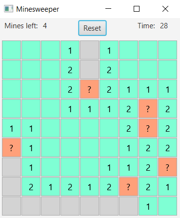

Java Mine Sweeper
==================

A basic implementation of the Mine Sweeper game using Java 8.

## Why?

Because I needed an excuse to program something in Java, and I had an old mine sweeper in Rust ready to be rewritten.
Plus I wanted to try JavaFX.

## How to play?

There are two interfaces to the game:

* Console: located at `src/main/java/console/Main.java`
* JavaFX GUI: located at `src/main/java/gui/Main.java`

Both rely on the same minesweeper implementation located at `src/main/java/board`.

## Screenshot!

Of course, no readme is complete without a screenshot... So here you go!

## Hey! Something is wrong in your code!

Then you can open a pull request. I promise I will look at it! Any nitpicks about Java style are welcome as well.
